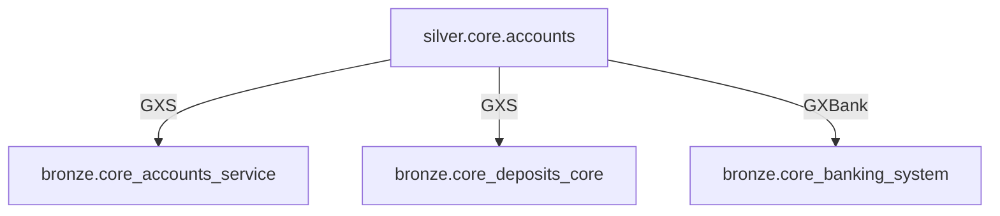

# dbt Cross-Bank Model Comparison & Homogenization Skill

## Goal
Compare two dbt transformer repositories (GXS Bank vs GXBank) to identify common, divergent, and unique models across bronze/silver/gold layers, then generate a prioritized homogenization plan.

## Discovery Phase

### 1. Gather Input from User

Ask the user for:
- **GXS Bank repo URL**: `https://gitlab.com/gx-regional/dakota/data-platform/digibank-transformer`
- **GXBank repo URL**: `https://gitlab.com/gx-regional/dbmy/data-platform/dbmy-transformer`
- **GitLab PAT**: Personal access token (same for both repos)
- **Report name** (optional): Defaults to `dbt-cross-bank-comparison-<timestamp>.html`

### 2. Clone Both Repositories

```bash
# Create temp directories
mkdir -p /tmp/compare-gxs /tmp/compare-gxbank

# Clone GXS repo
git -c http.sslBackend=openssl -c http.sslVerify=false clone --depth=1 \
  "https://oauth2:<PAT>@gitlab.com/gx-regional/dakota/data-platform/digibank-transformer" \
  /tmp/compare-gxs

# Clone GXBank repo
git -c http.sslBackend=openssl -c http.sslVerify=false clone --depth=1 \
  "https://oauth2:<PAT>@gitlab.com/gx-regional/dbmy/data-platform/dbmy-transformer" \
  /tmp/compare-gxbank
```

### 3. Extract Repository Metadata

For each repo, read:
- `dbt_project.yml` — layer configs, schemas, model counts
- `README.md` — project description
- `packages.yml` — dbt package dependencies
- Directory structure — list all models by layer

## Model Inventory Extraction

### Priority Order
Analyze in this order:
1. **Silver layer** (highest priority)
2. **Gold layer** (second priority)
3. **Bronze layer** (third priority)

### Python Script for Model Inventory

Use Python to extract detailed model metadata:

```python
#!/usr/bin/env python3
import re
import hashlib
import json
from pathlib import Path
from collections import defaultdict

def extract_columns_from_sql(sql_content):
    """
    Extract column names and their logic from SELECT clause.
    Handles:
    - Simple columns: column_name
    - Aliased columns: expression AS column_name
    - Qualified columns: table.column_name AS alias
    """
    columns = {}
    
    # Find SELECT clause (between SELECT and FROM)
    select_match = re.search(r'SELECT\s+(.*?)\s+FROM', sql_content, re.IGNORECASE | re.DOTALL)
    if not select_match:
        return columns
    
    select_clause = select_match.group(1)
    
    # Split by comma (simplified - doesn't handle nested functions perfectly)
    # For production, consider using sqlparse library
    column_lines = re.split(r',(?![^()]*\))', select_clause)
    
    for col_line in column_lines:
        col_line = col_line.strip()
        if not col_line:
            continue
        
        # Check for AS alias
        as_match = re.search(r'\s+AS\s+([a-z_][a-z0-9_]*)\s*$', col_line, re.IGNORECASE)
        if as_match:
            col_name = as_match.group(1).lower()
            col_logic = re.sub(r'\s+AS\s+[a-z_][a-z0-9_]*\s*$', '', col_line, flags=re.IGNORECASE).strip()
        else:
            # No AS - column name is the last identifier
            tokens = col_line.split()
            col_name = tokens[-1].lower()
            col_logic = col_line.strip()
        
        # Normalize logic (remove extra whitespace, lowercase keywords)
        col_logic = ' '.join(col_logic.split())
        
        columns[col_name] = col_logic
    
    return columns

def extract_refs(sql_content):
    """Extract ref() dependencies."""
    refs = []
    # Pattern: ref('layer', 'model') or ref("layer", "model")
    pattern = r"ref\(['\"]([a-z_]+)['\"],\s*['\"]([a-z_]+)['\"]\)"
    matches = re.findall(pattern, sql_content, re.IGNORECASE)
    for layer, model in matches:
        refs.append(f"{layer}.{model}")
    return refs

def extract_model_inventory(repo_path, repo_name):
    """Extract all models with detailed metadata."""
    repo_path = Path(repo_path)
    models = {}
    
    for layer in ['silver', 'gold', 'bronze']:  # Priority order
        layer_path = repo_path / 'models' / layer
        if not layer_path.exists():
            continue
        
        for sql_file in layer_path.rglob('*.sql'):
            domain = sql_file.parent.name
            model_name = sql_file.stem
            
            with open(sql_file, 'r', encoding='utf-8') as f:
                content = f.read()
            
            model_key = f"{layer}.{domain}.{model_name}"
            
            columns = extract_columns_from_sql(content)
            refs = extract_refs(content)
            
            models[model_key] = {
                'repo': repo_name,
                'layer': layer,
                'domain': domain,
                'name': model_name,
                'full_name': model_key,
                'path': str(sql_file.relative_to(repo_path)),
                'file_hash': hashlib.sha256(content.encode()).hexdigest(),
                'lines': len(content.splitlines()),
                'columns': columns,
                'column_count': len(columns),
                'refs': refs,
                'ref_count': len(refs)
            }
    
    return models

# Extract inventories
gxs_models = extract_model_inventory('/tmp/compare-gxs', 'GXS')
gxbank_models = extract_model_inventory('/tmp/compare-gxbank', 'GXBank')

# Save to JSON for later use
with open('/tmp/gxs_inventory.json', 'w') as f:
    json.dump(gxs_models, f, indent=2)

with open('/tmp/gxbank_inventory.json', 'w') as f:
    json.dump(gxbank_models, f, indent=2)

print(f"GXS models: {len(gxs_models)}")
print(f"GXBank models: {len(gxbank_models)}")
```

## Comparison Analysis

### Categorization Logic

**IMPORTANT**: "Common" models require:
1. Same domain + table name
2. Same column names
3. Same column logic (transformations)

```python
def compare_columns(gxs_cols, gxbank_cols):
    """
    Compare column dictionaries.
    Returns: (status, details)
    - 'identical': All columns match (names + logic)
    - 'similar': Same columns, minor logic differences
    - 'divergent': Different columns or major logic differences
    """
    gxs_names = set(gxs_cols.keys())
    gxbank_names = set(gxbank_cols.keys())
    
    if gxs_names != gxbank_names:
        return 'divergent', {
            'gxs_only_columns': list(gxs_names - gxbank_names),
            'gxbank_only_columns': list(gxbank_names - gxs_names),
            'common_columns': list(gxs_names & gxbank_names)
        }
    
    # Same column names - check logic
    logic_diffs = []
    for col_name in gxs_names:
        gxs_logic = gxs_cols[col_name]
        gxbank_logic = gxbank_cols[col_name]
        
        if gxs_logic != gxbank_logic:
            logic_diffs.append({
                'column': col_name,
                'gxs_logic': gxs_logic,
                'gxbank_logic': gxbank_logic
            })
    
    if not logic_diffs:
        return 'identical', {}
    elif len(logic_diffs) <= 2:  # Minor differences
        return 'similar', {'logic_diffs': logic_diffs}
    else:
        return 'divergent', {'logic_diffs': logic_diffs}

def categorize_models(gxs_models, gxbank_models):
    """
    Categorize models into:
    - identical: Same name, same columns, same logic
    - similar: Same name, same columns, minor logic differences
    - divergent: Same name, different columns or major logic differences
    - gxs_only: Only in GXS
    - gxbank_only: Only in GXBank
    """
    categories = {
        'identical': [],
        'similar': [],
        'divergent': [],
        'gxs_only': [],
        'gxbank_only': []
    }
    
    gxs_keys = set(gxs_models.keys())
    gxbank_keys = set(gxbank_models.keys())
    
    common_keys = gxs_keys & gxbank_keys
    
    for key in common_keys:
        gxs_model = gxs_models[key]
        gxbank_model = gxbank_models[key]
        
        # First check: file hash (fastest)
        if gxs_model['file_hash'] == gxbank_model['file_hash']:
            categories['identical'].append({
                'key': key,
                'gxs': gxs_model,
                'gxbank': gxbank_model,
                'match_type': 'file_hash'
            })
            continue
        
        # Second check: column-level comparison
        col_status, col_details = compare_columns(
            gxs_model['columns'],
            gxbank_model['columns']
        )
        
        if col_status == 'identical':
            categories['identical'].append({
                'key': key,
                'gxs': gxs_model,
                'gxbank': gxbank_model,
                'match_type': 'column_identical'
            })
        elif col_status == 'similar':
            categories['similar'].append({
                'key': key,
                'gxs': gxs_model,
                'gxbank': gxbank_model,
                'details': col_details
            })
        else:  # divergent
            categories['divergent'].append({
                'key': key,
                'gxs': gxs_model,
                'gxbank': gxbank_model,
                'details': col_details
            })
    
    # Unique models
    for key in (gxs_keys - gxbank_keys):
        categories['gxs_only'].append(gxs_models[key])
    
    for key in (gxbank_keys - gxs_keys):
        categories['gxbank_only'].append(gxbank_models[key])
    
    return categories

# Run comparison
comparison_results = categorize_models(gxs_models, gxbank_models)

# Save results
with open('/tmp/comparison_results.json', 'w') as f:
    json.dump(comparison_results, f, indent=2)

# Print summary
print("\n=== Comparison Summary ===")
print(f"Identical models: {len(comparison_results['identical'])}")
print(f"Similar models (minor diffs): {len(comparison_results['similar'])}")
print(f"Divergent models: {len(comparison_results['divergent'])}")
print(f"GXS-only models: {len(comparison_results['gxs_only'])}")
print(f"GXBank-only models: {len(comparison_results['gxbank_only'])}")
```

## Homogenization Strategy Generation

### Dual Strategy Recommendation

Generate both strategies:

#### Strategy 1: Shared dbt Package (Long-term)

```markdown
## Strategy 1: Extract to Shared Core Library

**Approach**: Create `gx-shared-models` dbt package

**Structure**:
```
gx-shared-models/
├── dbt_project.yml
├── models/
│   ├── silver/
│   │   ├── core/          ← Common core models
│   │   ├── onboarding/    ← Common onboarding models
│   │   └── lending/       ← Common lending models
│   └── gold/
│       ├── analytics/     ← Common analytics models
│       └── finance/       ← Common finance models
└── macros/
    └── shared_utils/      ← Common macro library
```

**Implementation Steps**:
1. Create new GitLab repo: `gx-shared-models`
2. Extract {X} identical models to shared package
3. Update both repos' `packages.yml`:
   ```yaml
   packages:
     - git: "https://gitlab.com/gx-regional/gx-shared-models"
       revision: main
   ```
4. Replace local models with `ref()` to shared package
5. Set up CI/CD for shared package versioning

**Pros**:
- Single source of truth for common logic
- Easier maintenance (update once, deploy twice)
- Enforces consistency

**Cons**:
- Initial setup overhead (3-4 weeks)
- Requires new CI/CD pipeline
- Dependency management complexity

**Estimated Effort**: 3-4 sprints
```

#### Strategy 2: Manual Convergence (Short-term)

```markdown
## Strategy 2: Prioritized Manual Convergence

**Approach**: Converge models layer-by-layer, domain-by-domain

**Phase 1: High-Priority Domains (Silver Layer)**
Target: Core, Onboarding, Lending

| Model | Action | Effort | Owner |
|-------|--------|--------|-------|
| silver.core.accounts | Merge: Use GXS logic + add GXBank columns | 2d | Team A |
| silver.onboarding.customer_master | Merge: Align column names | 1d | Team B |
| silver.lending.loan_core | Port GXS → GXBank | 3d | Team C |

**Phase 2: Medium-Priority Domains (Gold Layer)**
Target: Finance, Analytics, Risk

**Phase 3: Low-Priority Domains (Bronze Layer)**
Target: Source-specific adapters

**Rollout Plan**:
1. Create feature branch in both repos
2. Converge 5 models per sprint
3. Run parallel testing (both implementations)
4. Cutover after 2 weeks of parallel run

**Pros**:
- Faster time-to-value (start immediately)
- No new infrastructure
- Incremental risk

**Cons**:
- Ongoing maintenance burden
- Risk of re-divergence
- Manual sync required

**Estimated Effort**: 6-8 sprints
```

## HTML Report Generation

Generate a self-contained HTML report with these sections:

### 1. Executive Summary
- Total models compared
- Breakdown by layer (prioritized: Silver > Gold > Bronze)
- Pie chart: identical/similar/divergent/unique split
- Key recommendations

### 2. Comparison Matrix (Interactive Table)

```
| Priority | Layer | Domain | Model | GXS | GXBank | Status | Column Match | Logic Match | Action |
|----------|-------|--------|-------|-----|--------|--------|--------------|-------------|--------|
| 1 | silver | core | accounts | ✓ | ✓ | Divergent | 80% | No | Merge |
| 1 | silver | core | transactions | ✓ | ✓ | Similar | 100% | 95% | Align |
| 1 | silver | lending | loan_core | ✓ | ✓ | Identical | 100% | 100% | Reuse |
| 2 | gold | finance | gl_entries | ✓ | ✗ | GXS-only | - | - | Port? |
```

Filters:
- Layer (silver/gold/bronze)
- Status (identical/similar/divergent/unique)
- Domain (dropdown)

### 3. Identical Models Section

List all models that can be immediately reused:
- Model name
- Layer + domain
- Column count
- Dependency count
- Action: "Extract to shared package"

### 4. Divergent Models Deep Dive

For each divergent model, show:

**Side-by-side column comparison**:
```
Model: silver.core.accounts

| Column | GXS Logic | GXBank Logic | Match |
|--------|-----------|--------------|-------|
| account_id | core_accounts.id | core_accounts.account_number | ✗ Different source |
| balance | amount::decimal(18,2) | amount | ✗ Type mismatch |
| status | CASE WHEN active THEN 'ACTIVE' ELSE 'INACTIVE' END | status_code | ✗ Logic different |
| created_at | created_at | create_date | ✓ Similar (rename) |
```

**High-level logic differences**:
- ✓ Same WHERE clause
- ✗ Different JOIN logic (GXS has 3 joins, GXBank has 2)
- ✗ Different aggregations (GXS uses SUM, GXBank uses MAX)

**Dependency graph differences** (Mermaid):


**Recommended action**:
```
Action: Merge logic
1. Use GXS as base (more comprehensive joins)
2. Add GXBank column: account_type
3. Standardize column names: created_at → create_date
4. Test with both downstream dependencies
Effort: 2 days
Priority: High
```

### 5. Unique Models Analysis

**GXS-only models** (🔵):
- Assess if GXBank needs these
- Estimate porting effort
- Flag if country-specific (SG-only)

**GXBank-only models** (🟣):
- Assess if GXS needs these
- Flag if country-specific (MY-only)

### 6. Homogenization Roadmap

Include both strategies side-by-side with pros/cons.

### 7. Dependency Impact Map

Mermaid graph showing:
- How many gold models depend on divergent silver models
- Cascade impact of changes

### 8. Progress Tracker (for re-runs)

If report is re-generated:
- Show convergence progress over time
- Chart: % identical models over time
- Highlight newly converged models since last run

## Output Files

Generate these files:

1. **HTML Report**:
   ```
   ~/.agent/reports/dbt-cross-bank-comparison-<timestamp>.html
   ```
   - Self-contained (fonts/Mermaid via CDN)
   - Blueprint aesthetic (navy, cyan, IBM Plex fonts)
   - Interactive (sortable tables, expandable diffs)

2. **JSON Data Export**:
   ```
   ~/.agent/reports/comparison-data-<timestamp>.json
   ```
   - Raw comparison data
   - Can be imported to BI tools or Confluence

3. **Markdown Summary**:
   ```
   ~/.agent/reports/homogenization-plan-<timestamp>.md
   ```
   - Executive summary for stakeholders
   - Copy-pasteable to Jira/Confluence

## Cleanup

After report generation:

```bash
# Clean up cloned repos
rm -rf /tmp/compare-gxs
rm -rf /tmp/compare-gxbank

# Keep analysis files in /tmp for debugging (optional)
# rm /tmp/gxs_inventory.json /tmp/gxbank_inventory.json /tmp/comparison_results.json
```

## Success Criteria

The skill successfully completes when:
1. Both repos cloned and analyzed
2. Model inventories extracted (silver > gold > bronze priority)
3. Column-level comparison performed
4. HTML report generated and opened in browser
5. Summary shown in OpenCode chat:
   ```
   ✅ Comparison complete!
   
   📊 Summary:
   - Identical models: {X} (can reuse immediately)
   - Similar models: {Y} (minor alignment needed)
   - Divergent models: {Z} (significant work required)
   - GXS-only: {A}
   - GXBank-only: {B}
   
   🎯 Top recommendations:
   1. Extract {X} identical silver models to shared package
   2. Prioritize converging {top 5 divergent silver models}
   3. Evaluate {country-specific models} for regional differences
   
   📄 Full report: ~/.agent/reports/dbt-cross-bank-comparison-{timestamp}.html
   ```

## Error Handling

If errors occur:
- **Clone failure**: Check PAT validity, network connectivity
- **No models found**: Verify repo structure (models/silver, models/gold, models/bronze)
- **SQL parsing errors**: Log warnings but continue (report models as "unable to parse")
- **Memory issues**: Process in batches if repos are very large (>10K models)
