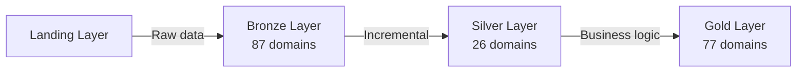

# GitLab Visual Docs Skill — OpenCode

> An **OpenCode Skill** that connects to private GitLab repositories, analyzes dbt projects, and generates beautiful standalone HTML visual documentation with interactive dependency maps, Mermaid diagrams, and blueprint aesthetics.

---

## 🧠 What is This Skill?

This OpenCode skill automatically:
1. **Clones** a private GitLab repository (with PAT authentication)
2. **Analyzes** the codebase structure (designed for dbt projects but adaptable)
3. **Extracts** domain dependencies by parsing SQL `ref()` calls
4. **Generates** a self-contained HTML visual documentation page with:
   - Hero section with tech stack badges
   - Mermaid architecture diagrams (data layers, data flow, CI/CD pipeline)
   - Interactive domain landscape organized by business function
   - Macro library catalog
   - Tech stack table
   - Getting started guide
   - Key files map
   - **Gold → Silver → Bronze dependency map** with expandable cards and search

---

## 🎨 Output Example

The skill generates a single `.html` file with:
- **Blueprint/technical aesthetic**: Deep navy background, cyan accents, IBM Plex Mono + Sans fonts
- **Self-contained**: No external dependencies except CDN (Google Fonts, Mermaid.js)
- **Dark/light theme toggle**
- **Interactive elements**: Expandable dependency cards, filterable domains
- **Mermaid diagrams**: Architecture flows, sequence diagrams, CI/CD pipelines

**Sample output:** `~/.agent/diagrams/digibank-transformer-visual-docs.html`

---

## 📂 Files

```
gitlab-visual-docs/
├── SKILL.md          ← OpenCode skill definition
└── README.md         ← This file
```

---

## ⚙️ Installation

### 1. Copy skill to OpenCode skills directory

```bash
cp -r gitlab-visual-docs ~/.config/opencode/skills/
```

### 2. Restart OpenCode or reload skills

The skill will be automatically available in OpenCode.

---

## 💬 Usage

### Basic usage

In OpenCode chat:

```
Generate visual documentation for this GitLab repo: https://gitlab.com/my-org/my-project
```

### Advanced usage with private repos

```
Document this private GitLab repo: https://gitlab.com/gx-regional/dakota/data-platform/digibank-transformer
Use this PAT: glpat-xxxxxxxxxxxxx
```

### The skill will:

1. **Prompt you** for:
   - GitLab repository URL
   - Personal Access Token (PAT) for private repos
   - Output file name (optional)

2. **Clone the repository** to `/tmp/gitlab-visual-docs-repo` using:
   ```bash
   git -c http.sslBackend=openssl -c http.sslVerify=false clone --depth=1 "https://oauth2:<PAT>@gitlab.com/..." /tmp/gitlab-visual-docs-repo
   ```

3. **Analyze the codebase**:
   - Read `dbt_project.yml`, `README.md`, `.gitlab-ci.yml`, `Dockerfile`, etc.
   - Count SQL files, YAML files, CSV seeds
   - Extract domain names from directory structure
   - Parse `ref()` calls in SQL to build dependency graph

4. **Generate HTML documentation** at:
   ```
   ~/.agent/diagrams/<project-name>-visual-docs.html
   ```

5. **Open in browser** automatically

6. **Clean up** temporary cloned repo

---

## 🛠️ Skill Capabilities

### Discovery Phase

The skill uses Python to parse all SQL files and extract dependencies:

```python
import re
from pathlib import Path

# Find all ref() calls in SQL files
for sql_file in Path('models/gold').rglob('*.sql'):
    refs = re.findall(r"ref\(['\"]([a-z_]+)['\"],\s*['\"]([a-z_]+)['\"]\)", content)
    # Build dependency map: gold → silver → bronze
```

### HTML Generation

The skill generates a complete HTML page with:

| Section | Implementation |
|---|---|
| **Hero** | Project name, tagline, tech badges |
| **Architecture** | Mermaid graph: Landing → Bronze → Silver → Gold → Internal |
| **Data Flow** | Mermaid sequence diagram: Vault → dbt → Snowflake → S3 |
| **Source Domains** | CSS Grid cards grouped by business function |
| **Macro Library** | Card grid of reusable SQL macros |
| **CI/CD Pipeline** | Mermaid flowchart of GitLab CI stages |
| **Tech Stack** | HTML table with tool, role, version |
| **Getting Started** | Copy-pasteable shell commands |
| **Key Files Map** | Annotated directory tree |
| **Dependency Map** | Interactive expandable cards showing gold → silver → bronze lineage |

---

## 🎯 Designed For

This skill is optimized for **dbt projects** but can be adapted for:
- Data transformation pipelines
- ETL projects
- Microservices architectures
- Monorepos with domain-driven design

**Key indicators the skill looks for:**
- `dbt_project.yml` (dbt configuration)
- `models/` directory (SQL models)
- `macros/` directory (reusable SQL)
- `.gitlab-ci.yml` (CI/CD pipeline)
- `Dockerfile` (containerization)

---

## 🔐 Authentication

### GitLab Personal Access Token (PAT)

For private repositories, you need a GitLab PAT with `read_repository` scope:

1. Go to **GitLab → Settings → Access Tokens**
2. Create a new token with:
   - **Name**: `opencode-visual-docs`
   - **Scopes**: `read_repository`
3. Copy the token (starts with `glpat-`)
4. Provide it when the skill prompts you

**Security note:** The skill clones to `/tmp/` and deletes the repo after generation. The PAT is never stored.

---

## 📊 Example Output Sections

### 1. Architecture Diagram (Mermaid)



### 2. Dependency Map (Interactive)

Click any gold domain to expand and see its silver and bronze dependencies:

```
aml_analytics ▼                        23 deps
  Silver Dependencies (6)
    ☐ biz  ☐ core  ☐ ecosystem_grab  ☐ grabx  ☐ lending  ☐ onboarding
  Bronze Dependencies (17)
    ☐ aml  ☐ aml_ops  ☐ aml_service  ☐ cards_digicard_txn  ☐ cards_euronet_adapter
    ☐ core_deposits_core  ☐ core_transaction_history  ☐ fraud  ...
```

### 3. Tech Stack Table

| Tool | Role | Version |
|---|---|---|
| dbt-core | SQL transformation orchestration | 1.8.6 |
| Snowflake | Cloud data warehouse | Enterprise |
| Python | Runtime environment | 3.12 |
| Docker | Container runtime | Latest |

---

## 🎨 Customization

### Change Theme Colors

Edit the CSS variables in the generated HTML:

```css
:root {
    --bg: #0a1628;           /* Background */
    --accent: #00d4ff;       /* Cyan accents */
    --text: #e8f4f8;         /* Text color */
    --surface: #0d1f3c;      /* Card background */
}
```

### Add More Sections

Modify the skill's HTML generation logic in `SKILL.md`:

```markdown
## Section 11: Your Custom Section

<div class="card-grid">
  <!-- Your content -->
</div>
```

---

## 🐛 Troubleshooting

### SSL Certificate Errors

If you get SSL errors when cloning:

```bash
# The skill uses this workaround:
git -c http.sslBackend=openssl -c http.sslVerify=false clone ...
```

### Dependency Map is Empty

The skill parses `ref()` calls like:

```sql
ref('silver', 'core_accounts')
```

If your project uses a different syntax, update the regex in the Python script.

### Mermaid Diagrams Not Rendering

Check browser console for errors. Make sure the Mermaid CDN is accessible:

```html
<script src="https://cdn.jsdelivr.net/npm/mermaid@10/dist/mermaid.min.js"></script>
```

---

## 📝 Example Projects

This skill has been tested on:

| Project | Description | Output |
|---|---|---|
| **digibank-transformer** | dbt project with 4,171 SQL files, 87 bronze domains, 77 gold domains | [View Sample](~/.agent/diagrams/digibank-transformer-visual-docs.html) |

---

## 🚀 Future Enhancements

- [ ] Support for other Git providers (GitHub, Bitbucket)
- [ ] Column-level lineage extraction
- [ ] SQL complexity metrics
- [ ] Data quality test coverage visualization
- [ ] Export to PDF
- [ ] Confluence integration

---

## 🤝 Contributing

To contribute improvements:

1. Fork the repo
2. Modify `SKILL.md`
3. Test with your own dbt projects
4. Submit a PR with examples

---

## 📄 License

MIT License — feel free to use and modify for your projects.

---

## 🙏 Credits

Built with:
- **OpenCode** — AI-powered coding assistant
- **Mermaid.js** — Diagram generation
- **IBM Plex** — Font pairing
- Inspired by [visual-explainer](https://github.com/nicobailon/visual-explainer)
